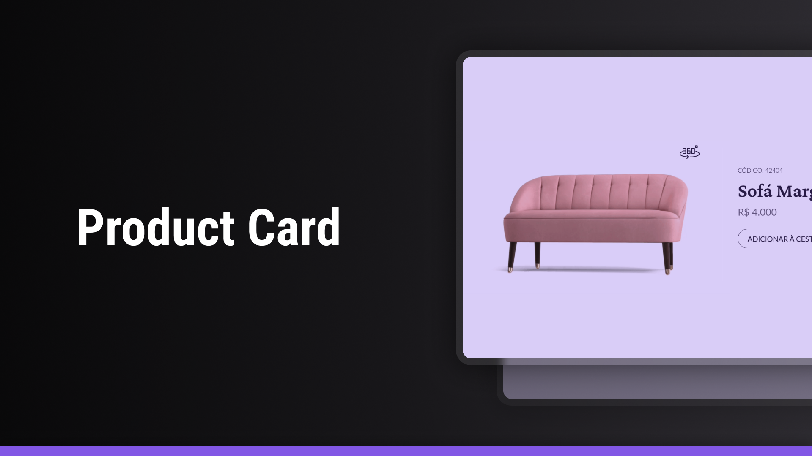

<h1 align="center">Product Card</h1>

  <a href="#-technologies">Technologies</a>&nbsp;&nbsp;&nbsp;|&nbsp;&nbsp;&nbsp;
  <a href="#-project">Project</a>&nbsp;&nbsp;&nbsp;|&nbsp;&nbsp;&nbsp;
  <a href="#-layout">Layout</a>

 

  

## 🚀 Technologies

This project was developed with the following technologies:

## 💻 Project

The product card is a component for displaying the details of a product for sale. It was designed for use in web applications.

##  Layout

You can view the project layout through [FROM THIS LINK](https://www.figma.com/design/SSt1YmjSZaccySM0Llm8Va/Card-de-Produto-%E2%80%A2-Desafio-02--Community-?node-id=601-145&t=U0wNGBt7flKz8xTx-1). It is necessary to have an account on
[Figma](https://figma.com) to access it.

## 🌍 Deployment

You can access the project directly through GitHub Pages:  
👉 [Product Card on GitHub Pages](https://augusto-valerio.github.io/product-card/)

---

Made by : [Augusto Valerio](https://github.com/Augusto-Valerio).
